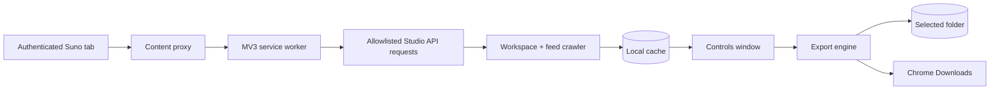

# Suno Power Exporter

> A focused Chrome MV3 extension for discovering, reviewing, and exporting an authenticated Suno library across every workspace.

[](https://developer.chrome.com/docs/extensions/mv3/intro/)
[](https://developer.mozilla.org/en-US/docs/Web/JavaScript)
[](docs/PRIVACY.md)

Suno Power Exporter is the publishable, extension-only successor to the original research workspace. It provides a durable controls window, complete workspace discovery, resilient feed pagination, local search and selection, and export controls that remain understandable when the library contains thousands of tracks.

> **Public-source boundary:** this repository intentionally contains **no `scratchpad/`, HAR files, request captures, browser exports, account identifiers, tokens, cookies, or personal telemetry**. See [Privacy & data boundaries](docs/PRIVACY.md).

---

## At a glance

| Capability | What it does |
|---|---|
| **All-workspace sync** | Pages `/api/project/me` using `current_page` and `num_total_results`, then drains every workspace feed cursor. |
| **Reliable pagination** | Treats `has_more: false` as terminal, rejects repeated cursors, and reports partial crawls instead of silently claiming success. |
| **Local library index** | Normalizes clip metadata, deduplicates by ID, caches the last sync, and supports search across titles, artists, models, prompts, tags, lyrics, workspaces, and IDs. |
| **Large-library UX** | Uses stable selection IDs, 100-row pagination, progress, coverage diagnostics, keyboard-accessible tabs, and safe DOM rendering. |
| **Output modes** | Writes through a user-selected File System Access directory or uses Chrome Downloads, including metadata sidecars where supported. |
| **Format honesty** | M4A, MP3, and WAV controls describe source requirements; unsupported or unavailable sources are reported rather than presented as guaranteed conversions. |
| **Diagnostics** | Redacted, bounded activity log, retry/backoff status, explicit warnings, and honest per-item export results. |

---

## Quick start

### Requirements

- Google Chrome or another Chromium browser with Manifest V3 support.
- A signed-in Suno session in a normal browser tab.
- Network access to the Suno Studio API and media hosts used by the selected account.

### Load the extension locally

1. Clone this repository.
2. Open `chrome://extensions`.
3. Enable **Developer mode**.
4. Choose **Load unpacked**.
5. Select the `extension/` directory.
6. Open or refresh a signed-in `https://suno.com` tab.
7. Click the **Suno Power Exporter** action.

The action opens a persistent controls window rather than a short-lived popup, which keeps long syncs and exports visible.

### Run the checks

```bash
cd extension
npm test
npm run check
```

The test suite covers workspace pagination, cursor termination, nested feed wrappers, filter serialization, retries, cancellation, settings migration, IndexedDB handle persistence, MP3 source handling, and diagnostics.

---

## Using the exporter

1. Open **Library** and choose the sync scope.
2. Leave **Skip disliked** off for a complete library sync; enable it when you intentionally want the filtered view.
3. Select **Sync library** and keep the controls window open while the workspace crawl runs.
4. Use the local search field and workspace selector to narrow the cached index without issuing an API request per keystroke.
5. Select a page, all matching tracks, or individual tracks.
6. Choose an output format and destination, then start the export.
7. Review the Activity panel for skipped, unavailable, failed, or cancelled items.

The controls window shows discovered workspaces, reported project counts, loaded tracks, filtered/unavailable differences, and partial-sync warnings. A cached library remains available if a later sync is incomplete.

---

## Architecture at a glance



- **Service worker:** window routing, request proxying, auth-header capture, and short-lived coordination.
- **Content script:** page-context `fetch` relay with an exact Studio API origin allowlist.
- **Library crawler:** project pagination, feed cursor traversal, normalization, deduplication, filtering, and coverage diagnostics.
- **Controls window:** accessible UI, local cache, search, selection, progress, and settings.
- **Export engine:** source resolution, metadata/tagging, File System Access output, and completion-aware browser downloads.

Read [Architecture](docs/ARCHITECTURE.md) for the detailed data flow and [Development](docs/DEVELOPMENT.md) for extension points and validation guidance.

---

## Repository layout

```text
.
├── extension/                 # Load this directory in Chrome
│   ├── manifest.json          # MV3 permissions and entry points
│   ├── background.js          # Service-worker coordination
│   ├── content/               # Page relay and optional inline actions
│   ├── controls/              # Durable controls window
│   ├── lib/                   # API, feed, storage, tagging, and output
│   └── tests/                 # Node built-in regression tests
├── docs/                      # Architecture, usage, privacy, and history
├── CHANGELOG.md               # Public release history
├── README.md
└── .gitignore
```

---

## Documentation map

- [User guide](docs/USER_GUIDE.md) — setup, sync scope, search, selection, and exports.
- [Architecture](docs/ARCHITECTURE.md) — modules, API contracts, pagination, caching, and messaging.
- [Development](docs/DEVELOPMENT.md) — local checks, extension loading, and safe contribution workflow.
- [Privacy & data boundaries](docs/PRIVACY.md) — what is stored, what is never published, and operational cautions.
- [Changelog](CHANGELOG.md) — detailed public release history.

---

## Scope and limitations

- Suno’s Studio endpoints are not a stable public API. The extension is intended for users who are allowed to access and export their own content.
- Feed availability and media formats vary by account, workspace, model, and region. MP3, WAV, and tagged output are best-effort and are not guaranteed for every clip.
- The project does not include captured account data, private research artifacts, or credentials.
- Users are responsible for reviewing downloaded content, applicable terms, and local laws before redistribution.

---

## Contributing

Please keep changes focused, add regression coverage for behavior changes, and never add real tokens, cookies, HAR files, account exports, or personal telemetry. Read [Development](docs/DEVELOPMENT.md) before submitting a change.

## License

No license has been selected in this archival release. Add an explicit license before redistributing the code or packaged builds beyond personal use.
