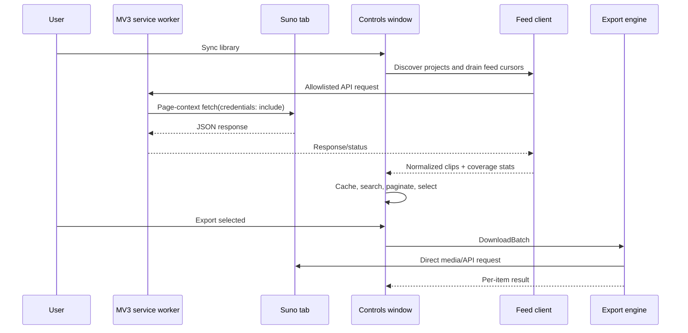

# Architecture

## Design goals

The extension is intentionally split into a service worker, a page relay, a library client, a durable controls window, and an output engine. Each boundary has one reason to exist:

- the service worker survives controls-window navigation;
- the content relay preserves the signed-in page session;
- the feed client makes pagination correctness testable without Chrome;
- the controls window owns DOM, selection, and long-running job presentation;
- the output engine isolates filesystem and download side effects.

## Runtime flow



## Project discovery

`fetchWorkspacesDetailed()` requests `/api/project/me` with `page`, `sort=created_at`, `show_trashed=false`, and `exclude_shared=false`. The endpoint is treated as authoritative only through its actual contract:

- `projects`: project records on the current page;
- `current_page`: server page number;
- `num_total_results`: total project count when supplied.

There is no dependency on a `has_more` field that the endpoint does not provide. Short/empty pages terminate compatibility crawls, totals are carried across pages, changing totals are partial results, and a mismatched `current_page` is an error.

## Feed traversal

For each workspace, the client sends `POST /api/feed/v3` with:

- `cursor: null` for the first page;
- `limit: 100` for normal pages;
- an exact workspace ID;
- `trashed: "False"` by default;
- `disliked: "False"` only when the requested scope excludes disliked clips.

`has_more: false` is terminal even when a page contains 100 records. When `has_more: true`, the next cursor must be non-empty and advance. Repeated or missing cursors are surfaced as incomplete sources rather than silently breaking the loop.

The optional legacy feed is a separate source. It is not silently mixed into a successful v3 crawl; enabling it explicitly makes its failures visible.

## Normalized clip model

A normalized clip keeps both a small UI shape and the raw API record:

```js
{
  id,
  title,
  artist,
  album,
  model,
  prompt,
  lyrics,
  tags,
  workspace_id,
  is_upload,
  is_liked,
  is_disliked,
  is_trashed,
  raw
}
```

Membership uses `raw.project.id` when present and falls back to the workspace ID used for the request. This is important for the special `default` workspace, whose feed records may omit project membership.

## State and persistence

- `chrome.storage.local`: settings, auth session handoff, normalized library cache, and short-lived control messages.
- IndexedDB `sppe_dir`: File System Access directory handle.
- `chrome.downloads`: browser-mode output and completion events.
- The controls window owns transient selection, active job state, and the rendered library index.

The cache is normalized on load and can migrate older per-workspace track arrays. A failed sync never replaces a usable cache with a misleading empty success.

## Messaging and security boundaries

The service worker validates the destination origin, HTTP method, and a small header allowlist before relaying a request to a content script. Controls-targeted messages use an explicit `target: "controls"` marker and a bounded queue. Raw token values are never written to the activity log.

The extension does not publish or require captured account artifacts. See [Privacy & data boundaries](PRIVACY.md).

## Extension points

- Add API behavior in `lib/api.js` and pure pagination/normalization behavior in `lib/feed.js`.
- Add output behavior in `lib/engine.js` and `lib/directory.js`.
- Add UI state transitions in `controls/controls.js`; keep remote values out of `innerHTML`.
- Add focused Node built-in tests under `extension/tests/`.
